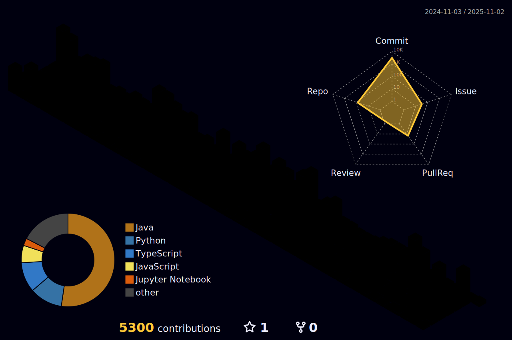

  

<h2>💡 About Me!  </h2>

<h>🖐 데이터를 기반으로 더 나은 서비스를 도출하는 백엔드 개발자 오태훈 입니다 </b>.    </h>

<h2>🎓 Work Experience</h2>

|소속 및 단체|활동 기간|내용|
|---|---|---|
|OO대학교|17.03~24.02  | OO대학교 린튼글로벌스쿨 글로벌비즈니스학과 / 빅데이터전공 졸업|
|(주)NIDSoft|24.06 ~ | (주)NIDSoft 시스템 사업부 제조파트 풀스택 개발자|
|(주)천재교육|23.09 ~ 24.05| (주)천재교육 디지털사업본부 디지털러닝팀 백엔드/DevOps|
|(주)유진바이오텍|22.06 ~ 22.09| (주)유진바이오텍 취업연계근로장학생 개발팀 FrontEnd 개발|
|(주)에코바이오의학연구소|22.03 ~ 22.06| (주)에코바이오의학연구소 자사 브랜드 HeadSpaK 취업연계근로장학생 BackEnd 개발|
|(주)다른코리아|21.12 ~ 22.03| (주)다른코리아 개발팀 BackEnd 인턴 개발자 |

<h2>🎓 Social Activity</h2>
|소속 및 단체|활동 기간|내용|
|---|---|---|
|(주)웅진북센|21.01 ~ 21.04| (주)웅진북센 디지털 전자책 혁신아이디어 공모전   전자책 대여 어플리케이션 "팀_신기루" 팀장 / BackEnd|
|데이터청년캠퍼스|22.06 ~ 22.09| 2022 데이터청년캠퍼스 - OO대학교 "WakeForCargo" 팀장   BackEnd, MLOps |
|대덕구청|22.08 ~ 22.09|2022 대덕구 리빙랩 프로젝트 "ECO_TVY"   지역 내 쓰레기 분류 기반 객체 인식 모델 플랫폼 "ECO_TVY"   FullStack, MLOps 개발|
|대덕구청|21.03 ~ 21.12|2022 대덕구 청년 네트워크 데이터 분석(취, 창업 분야) 총괄   MLOps|
|멘도롱대학|21.05 ~ 21.12| 2022 예비창업패키지 창업팀 "청춘의 한 장"   전문가 추천 기반 대학생 교육 멘토링 추천 플랫폼 "멘도롱 대학"   기획 / BackEnd 개발 |
|TeamLimked|22.03 ~ 22.12| 2022 초기창업패키지 창업팀 "TeamLimked"   아이템 추천 기반 건강기능식품 추천 플랫폼 "MediRing" 팀장   BackEnd 개발 |
|Weebinder|23.04 ~ 23.12| 2023 초기창업패키지 창업팀 Weebinder   일상 루틴 추천 플랫폼 "DayMaker" 개발팀 팀장   BackEnd 개발 |
|한이음 멘토링|23.05 ~ 23.11| 2023 한이음 멘토링 한국IBM 연계 "Generative AI를 활용한 교육서비스 개발" 팀장   BackEnd 개발 |
|멋쟁이사자처럼 11기|23.02 ~23.12| 2023 멋쟁이사자처럼 11기 OO대학교   OO대학교 대표 / 백엔드 운영 총괄|
|APCS Forum|17.06 ~| Delegate of 2017 APCS(Asia Pacific Cities Summit & Mayors' Forum)|

<h2>💻 Projects - 추가중..</h3>

|기간|내용|도메인|역할|
|---|---|---|---|
|2024.07 ~ 2024.09| (주)진성정밀 차세대 클라우드 시스템 Saas 플랫폼 구축|<a href="#">사내 내부 보안으로 인한 링크 첨부 불가</a>| 풀스택 개발/DevOps | 
|2024.04 ~ 2024.06| (주)천재교육 디지털사업본부 디지털러닝팀 천재IT교육센터 통합관리시스템 구축|<a href="http://chunjae-it-edu.com/">천재IT교육센터 통합관리시스템 구축</a>| 백엔드 개발/DevOps | 
|2024.02 ~ 2024.03| (주)천재교육 디지털사업본부 디지털러닝팀 천재IT교육센터 랜딩페이지 구축|<a href="http://chunjae-learning.com">천재IT교육센터</a>| 백엔드 개발/DevOps |
|2023.06 ~ 2023.07| 노인 교육 격차 해소 웹 플랫폼 |<a href="elderlinker.vercel.app/">ElderLinker</a>| 풀스택 개발 | 
|2023.08 ~ 2023.08| 북스토어 기반 구매 웹 사이트 |<a href="/">MoreVisionBooks</a>| 백엔드 개발 | 
|2023.07 ~ 2023.08| 학생, 학부모 가상 교육 기업 웹 사이트 |<a href="/">CanMoreVision</a>| 백엔드 개발 | 
|2023.04 ~ 2023.06| 5개 대륙 여행 코스 데이터 기반 여행 상품 구매 플랫폼 |<a href="/">TravelGURU</a>| 프론트엔드 개발 | 
|2023.04 ~ 2023.06| 서울특별시 내 4개 구별 주택 가격 데이터 분석 웹 대시보드 |<a href="/">LeeEung</a>| 백엔드/MLOps | 
|2022.07 ~ 2022.09| 화물차 운전자 동체 인식 기반 객체 인식 애플리케이션 | <a href="/">WakeForCargo</a>| 백엔드/MLOps | 
|2022.04 ~ 2022.09| (주) 에코바이오의학연구소 자사 브랜딩 HeadSpaK 웹사이트 제작 |<a href="http://headspak.com/">헤드스파K</a>| 풀스택 개발 | 

<h2>🎖️ Awards/Certificates</h2>

<d>🥇 기록중 </d>
 

<d>🥇 기록중 </d>
 

<d>🥇 기록중 </d>

 
<d></d>

<h2>👨‍💻 Tech Skills!  </h2>
<h3> 📲 Frontend </h3>

<h3>⚒ Backend </h3>

  

<h2>📝 Tools and SNS </h2>

<a href="https://instagram.com/https://www.instagram.com/canmoreapdalisal/" target="_blank">

 

  
